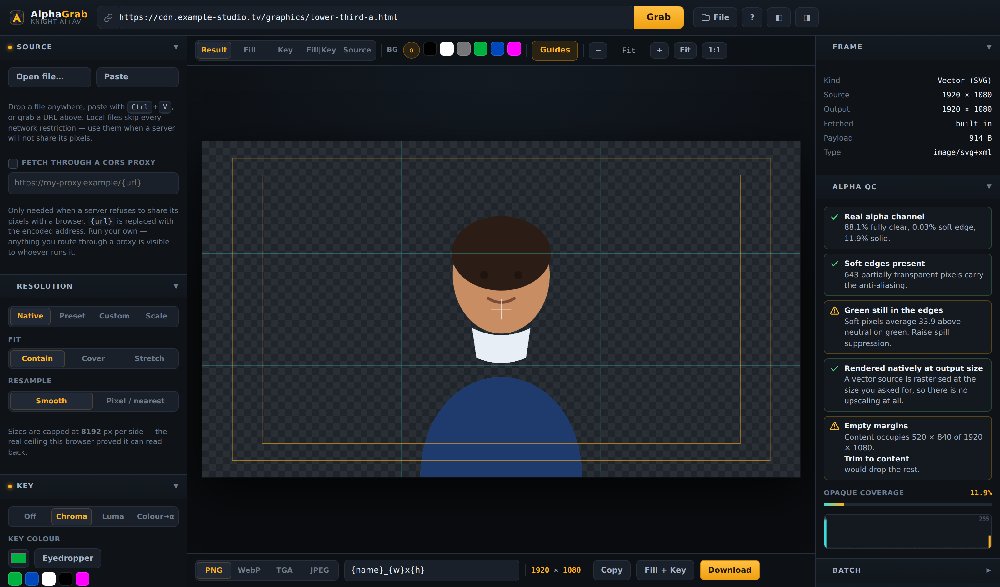

<div align="center">

# AlphaGrab

**Any URL in. A high-resolution frame with a real alpha channel out.**

A single HTML file for broadcast, AV and multimedia people. No account, no upload,
no server, no build step to use it — open it and work.

*by Knight AI+AV*



</div>

---

## What it does

Paste a URL. AlphaGrab fetches it, works out what it is, renders it at the resolution
you ask for, and hands you a frame whose transparency is real and measured.

| Source | What happens |
|---|---|
| **Image** — PNG, WebP, AVIF, GIF, JPEG, BMP, ICO | Decoded, alpha preserved exactly, resampled properly |
| **SVG** | Rasterised *natively at the output size*, so 8K is genuinely 8K — never an upscale |
| **HTML graphics template** | Run for real so its scripts execute, given time to settle on its hold frame, then **repainted as native SVG** — so the export is vector and scales to 8K without enlargement |
| **Local file** | Dropped, pasted or opened — skips every network restriction |

## Why an AV person would keep this in a bookmark

- **Chroma key with spill suppression.** Colour-difference keying, so a backdrop with
  uneven lighting still keys clean instead of punching holes in the middle.
- **Colour→α.** Removes a flat background *and* unmixes it back out of anti-aliased
  edges — the difference between a logo that keys and a logo with a white halo.
- **Luma key** for graphics delivered on flat black or flat white.
- **Matte tools:** choke and grow, feather, matte gamma and gain, trim to content.
- **Fill + key export.** Two files — an opaque RGB fill and a greyscale key — which is
  what a switcher or a playout server actually wants over two paths.
- **Straight or premultiplied**, in and out, because Notch, Resolume, After Effects
  and most switchers do not agree and the wrong one shows up as dark edges.
- **13 output presets** from HD through DCI 4K and 8K to vertical and LED ribbons,
  plus any custom size up to **8192 px per side**.
- **Title and action safe guides**, thirds, centre cross.
- **Preview against black, white, 18% grey, chroma green, blue and magenta** — the
  classic check for edges and spill before the frame reaches air.
- **Alpha QC.** It counts the pixels and tells you the truth: whether there is any
  transparency at all, how much of the matte is soft, whether the file looks
  premultiplied already, whether green is still sitting in the edges.
- **Batch.** One URL per line, up to **50 URLs**, processed with the current settings
  and delivered as a ZIP.
- **Writes **PNG, WebP, TGA and JPEG**.** 32-bit uncompressed TGA is there for
  CasparCG, Resolume, Notch and older playout that never got on with PNG alpha.
- **Shareable links.** One button copies a URL carrying the source and every slider,
  so an operator opens the identical setup.

## What it does not do, and says so

A tool that fails quietly is worse than one that cannot do the job. AlphaGrab is built
to report the difference:

- **CORS.** A browser may only read pixels a server agrees to share. When a host does
  not send `Access-Control-Allow-Origin`, AlphaGrab first proves the server is
  reachable, then names CORS as the reason — rather than exporting a blank frame.
  Drop the file in instead, or route it through a proxy you run yourself.
- **HTML templates.** Boxes, gradients, borders, radii, opacity, images, inline SVG
  and text survive the repaint with their layout intact. Box shadows, CSS filters,
  blend modes, clipping and rotate/scale transforms do not — and each one that is
  actually present is named in a warning rather than quietly dropped. Assets from
  servers without CORS cannot be embedded and are reported as missing. Anything
  painted after the settle delay is not in the frame.

  *Why repaint rather than wrap the DOM in an SVG `<foreignObject>`, which is one
  line?* Because Chromium taints every canvas such an image touches: the frame
  renders on screen and then cannot be read back at all, silently. It is checked in
  `tests/browser.mjs` rather than taken on trust.
- **Upscaling.** A bitmap enlarged past its own resolution is interpolation. AlphaGrab
  labels it instead of calling it detail. Vectors and HTML have no such limit.
- **Canvas ceilings.** Browsers disagree on the largest canvas they will allocate, and
  an oversized one fails *silently* — it reads back empty. AlphaGrab writes and reads a
  probe pixel at start-up and shows the real ceiling under **About**.
- **Encoder substitution.** Ask Chrome for a format it cannot write and it hands back a
  PNG with the wrong extension. AlphaGrab checks the blob's own type and refuses.

## Privacy

There is no server and no account. Decoding, keying and encoding all happen in the tab.
The only request the tool makes is for the URL you type. Save the page to disk and it
keeps working with no network at all — which is the point on a show floor.

## Build and test

```bash
npm run build     # src/ → docs/index.html, one self-contained file
npm test          # guard tests: every public claim is read back out of the constant that enforces it
npm run check     # both
node tests/browser.mjs   # drives the real page in Chromium and checks the exported pixels
```

`docs/index.html` is committed. It is the artefact that ships, and committing it is what
keeps the tree describing what is actually live.

## Hosting targets

This is served from more than one place, and they drift independently. Before saying
"it is live", say *where*:

| URL | Role | Source |
|---|---|---|
| `knightaiav.com/alpha-grab/` | what people visit | `docs/` copied into the site |
| GitHub Pages (`/docs` on the default branch) | public mirror and permalink | this repo |
| `docs/index.html` on disk | show-laptop copy, works offline | this repo |

Deploying is copying `docs/` — there is no build step on the host, no Actions workflow
and nothing to install.

---

<sub>Version 0.1.0. It becomes 1.0 the day we would pay for it ourselves.</sub>

<sub>© Knight AI+AV. All rights reserved.</sub>
